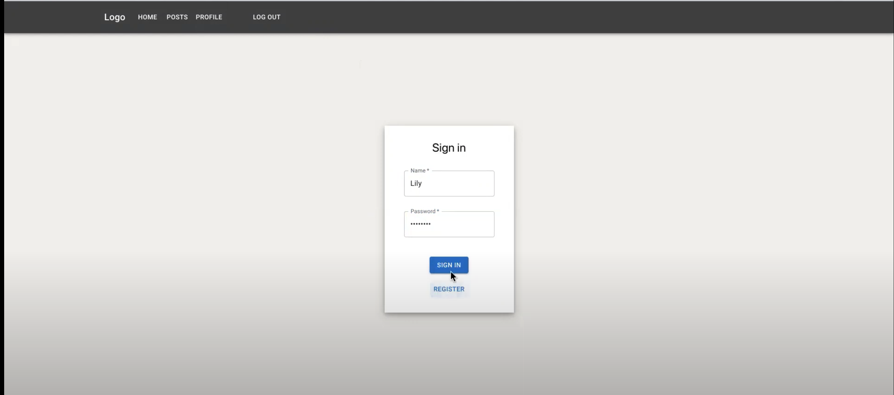
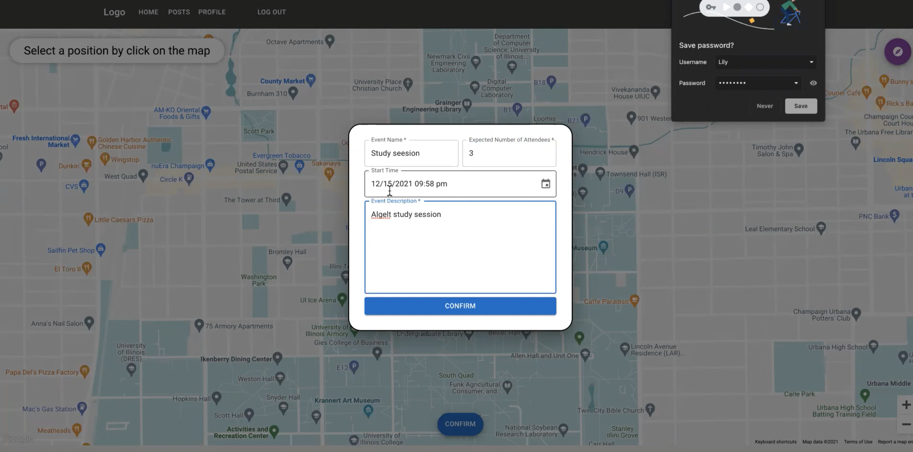
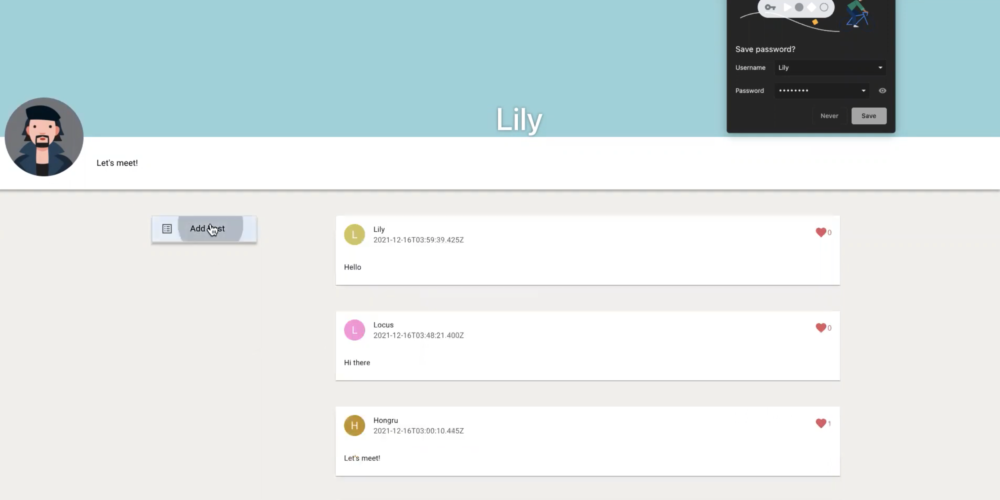
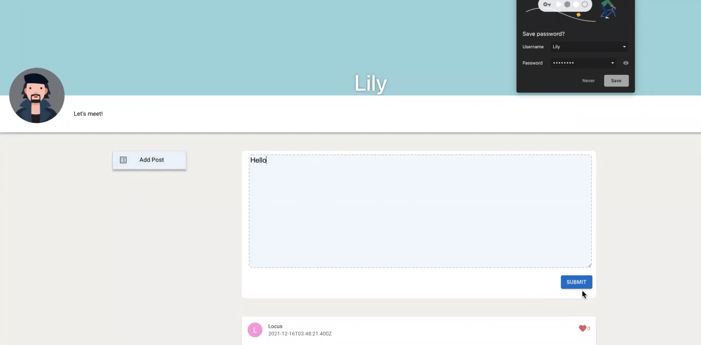
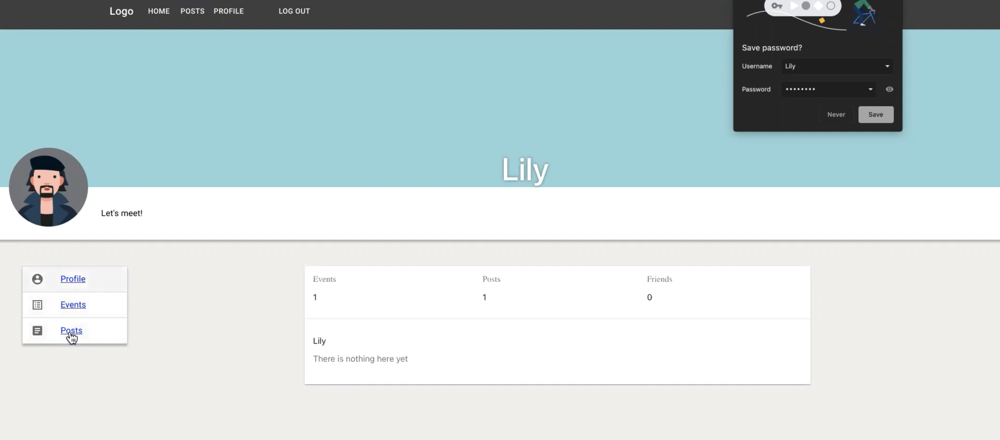

# Fa21 Cs498rk Project by TriCorn

## Description
- FrontEnd: ReactJS
- REST api: NodeJS, ExpressJS
- Database: MongoDB

Interactive Map with Google Map API

## Structure

- Frontend goes to the client folder
- Backend goes to the api folder

## Notes

- run `npm install` inside the client and the api folder each time you clone/pull the project.

## GUI
### Login / Signin

### Join event found in map

### Create event
You can create event by clicking on the location you want in map

### Post page
You can see you post and your friends' post in this page

### Add post
You can add your post

### Personal Profile

